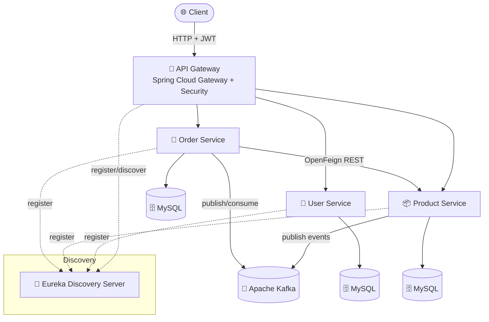

<div align="center">

# 🛒 E-Commerce Backend — Microservices Architecture

### _A production-grade, scalable e-commerce backend built with Spring Boot Microservices_

Powered by **Spring Cloud**, **Netflix Eureka**, **API Gateway**, **Apache Kafka**, and **MySQL** — designed with clean service boundaries, event-driven communication, and centralized routing & security.

<br />

<!-- Core Tech Badges -->


<br />


<br />

[🐛 Report Bug](https://github.com/harsh589/E-commerce-Backend/issues) · [✨ Request Feature](https://github.com/harsh589/E-commerce-Backend/issues)

</div>

<br />

---

## 📑 Table of Content

<details>
<summary><strong>Click to expand</strong></summary>

- [🌟 Overview](#-overview)
- [🏗️ System Architecture](#️-system-architecture)
- [🧩 Microservices](#-microservices)
- [✨ Key Features](#-key-features)
- [🛠️ Tech Stack](#️-tech-stack)
- [📂 Project Structure](#-project-structure)
- [🚀 Getting Started](#-getting-started)
- [⚙️ Running the Services](#️-running-the-services)
- [🐳 Docker & Kafka Setup](#-docker--kafka-setup)
- [🔌 Service Ports](#-service-ports)
- [🧭 Roadmap](#-roadmap)
- [🤝 Contributing](#-contributing)
- [📄 License](#-license)
- [👤 Author](#-author)

</details>

---

## 🌟 Overview

**E-Commerce Backend** is a **microservices-based** system that decomposes a typical online store into independent, independently-deployable services. Each service owns its own data and communicates via **REST (OpenFeign)** for synchronous calls and **Apache Kafka** for asynchronous, event-driven workflows.

The architecture emphasizes:

- 🧭 **Service Discovery** — Dynamic registration & lookup via Netflix Eureka.
- 🚪 **Single Entry Point** — All client traffic routed through a Spring Cloud API Gateway.
- 🔐 **Centralized Security** — JWT-based authentication enforced at the gateway.
- 📨 **Event-Driven Communication** — Kafka decouples services for scalability & resilience.
- 🗄️ **Database per Service** — Independent MySQL persistence with Spring Data JPA.

> 💼 _This project demonstrates real-world backend engineering concepts: distributed systems, inter-service communication, event streaming, and containerization.

---

## 🏗️ System Architecture



---

## 🧩 Microservices

| Service | Description | Key Technologies |
| ------- | ----------- | ---------------- |
| 🧭 **discovery-server** | Netflix Eureka server for service registration & discovery. | Spring Cloud Netflix Eureka Server |
| 🚪 **gateway** | Single entry point; routing, load balancing & JWT security. | Spring Cloud Gateway, Spring Security, JJWT, Eureka Client |
| 👤 **user-service** | Manages users, registration & authentication (JWT issuance). | Spring Data JPA, Spring Security, JJWT, Lombok, MySQL |
| 📦 **product-service** | Manages product catalog; publishes product events. | Spring Data JPA, Spring Kafka, MySQL, Eureka Client |
| 🧾 **order-service** | Handles orders; calls product-service via Feign; Kafka events. | Spring Data JPA, OpenFeign, Spring Kafka, Actuator, MySQL |

---

## ✨ Key Features

- 🧭 **Service Discovery** with Netflix Eureka — no hardcoded service URLs.
- 🚪 **API Gateway** — centralized routing, filtering & cross-cutting concerns.
- 🔐 **JWT Authentication** — stateless, secure token-based auth (JJWT `0.11.5`).
- 📨 **Event-Driven Architecture** — Apache Kafka for async communication.
- 🔗 **Inter-Service Communication** — declarative REST clients via **OpenFeign**.
- 🗄️ **Database per Service** — independent MySQL databases with Spring Data JPA.
- 📊 **Observability** — Spring Boot Actuator endpoints for monitoring.
- 🐳 **Containerized Infrastructure** — Kafka & Zookeeper via Docker Compose.
- ⚡ **Hot Reload** — Spring Boot DevTools for faster development.

---

## 🛠️ Tech Stack

<table>
<tr>
<td valign="top" width="50%">

### ⚙️ Core
- **Java 17**
- **Spring Boot** (3.2.5 / 4.0.x)
- **Spring Cloud** (2023.0.1 / 2025.1.1)
- **Maven** (multi-module build)

### 🌐 Cloud & Communication
- Spring Cloud Gateway
- Netflix Eureka (Server + Client)
- Spring Cloud OpenFeign

</td>
<td valign="top" width="50%">

### 🗄️ Data & Messaging
- Spring Data JPA
- MySQL
- Apache Kafka + Zookeeper

### 🔐 Security & Tooling
- Spring Security
- JSON Web Token (JJWT)
- Lombok
- Spring Boot Actuator
- Docker & Docker Compose

</td>
</tr>
</table>

---

## 📂 Project Structure

```text
E-commerce-Backend/
├── discovery-server/        # 🧭 Eureka service registry
│   ├── src/
│   └── pom.xml
├── gateway/                 # 🚪 API Gateway (routing + JWT security)
│   ├── src/
│   └── pom.xml
├── user-service/            # 👤 User management & authentication
│   ├── src/
│   └── pom.xml
├── product-service/         # 📦 Product catalog + Kafka producer
│   ├── src/
│   └── pom.xml
├── order-service/           # 🧾 Orders + Feign client + Kafka
│   ├── src/
│   └── pom.xml
├── docker-compose.yml       # 🐳 Kafka + Zookeeper infrastructure
└── README.md
```

Each service is a **standalone Spring Boot application** with its own Maven wrapper (`mvnw`), making it independently buildable and deployable.

---

## 🚀 Getting Started

### ✅ Prerequisites

- [Java 17](https://adoptium.net/) or higher
- [Maven](https://maven.apache.org/) (or use the bundled `./mvnw`)
- [Docker & Docker Compose](https://www.docker.com/)
- [MySQL](https://www.mysql.com/) running locally (or via Docker)

### 📥 Clone the repository

```bash
git clone https://github.com/harsh589/E-commerce-Backend.git
cd E-commerce-Backend
```

---

## ⚙️ Running the Services

> ⚠️ **Start order matters:** launch the **discovery-server first**, then the **gateway**, then the individual services so they can register with Eureka.

**1️⃣ Start the Discovery Server**
```bash
cd discovery-server
./mvnw spring-boot:run
```

**2️⃣ Start the API Gateway**
```bash
cd gateway
./mvnw spring-boot:run
```

**3️⃣ Start the business services** (each in its own terminal)
```bash
cd user-service    && ./mvnw spring-boot:run
cd product-service && ./mvnw spring-boot:run
cd order-service   && ./mvnw spring-boot:run
```

> 💡 On Windows, use `mvnw.cmd` instead of `./mvnw`.

---

## 🐳 Docker & Kafka Setup

Apache Kafka and Zookeeper are provided via Docker Compose. Start them **before** running `product-service` and `order-service`:

```bash
docker-compose up -d
```

This spins up:

| Component | Image | Port |
| --------- | ----- | ---- |
| **Zookeeper** | `confluentinc/cp-zookeeper:7.5.0` | `2181` |
| **Kafka** | `confluentinc/cp-kafka:7.5.0` | `9092` |

To stop:
```bash
docker-compose down
```

---

## 🔌 Service Ports

> ℹ️ _Update these to match your `application.properties` / `application.yml` configuration._

| Service | Default Port |
| ------- | ------------ |
| 🧭 Discovery Server (Eureka) | `8761` |
| 🚪 API Gateway | `8080` |
| 👤 User Service | `8081` |
| 📦 Product Service | `8082` |
| 🧾 Order Service | `8083` |
| 📨 Kafka | `9092` |
| 🔗 Zookeeper | `2181` |

Once running, open the **Eureka Dashboard** at 👉 `http://localhost:8761` to see all registered services.

---

## 🧭 Roadmap

- [ ] 🧾 Add centralized configuration (Spring Cloud Config Server)
- [ ] 🛡️ Add resilience with Circuit Breaker (Resilience4j)
- [ ] 📊 Distributed tracing (Zipkin / Micrometer)
- [ ] 📚 API documentation (Swagger / OpenAPI)
- [ ] 🐳 Dockerize all microservices + full `docker-compose` stack
- [ ] ☸️ Kubernetes deployment manifests
- [ ] 🧪 Integration & contract testing
- [ ] 🔔 Notification service (email/SMS on order events)

---

## 🤝 Contributing

Contributions are welcome! To contribute:

1. Fork the Project
2. Create your Feature Branch (`git checkout -b feature/AmazingFeature`)
3. Commit your Changes (`git commit -m 'Add some AmazingFeature'`)
4. Push to the Branch (`git push origin feature/AmazingFeature`)
5. Open a Pull Request

---

## 📄 License

This project is currently **unlicensed**. Consider adding an open-source license (e.g. [MIT](https://choosealicense.com/licenses/mit/)) to clarify usage terms.

---

## 👤 Author

**Harsh** — [@harsh589](https://github.com/harsh589)

<div align="center">

<br />

**⭐ If this project helped you or impressed you, please give it a star! ⭐**

_Built with ☕ Java & 🍃 Spring Boot Microservices_

</div>
